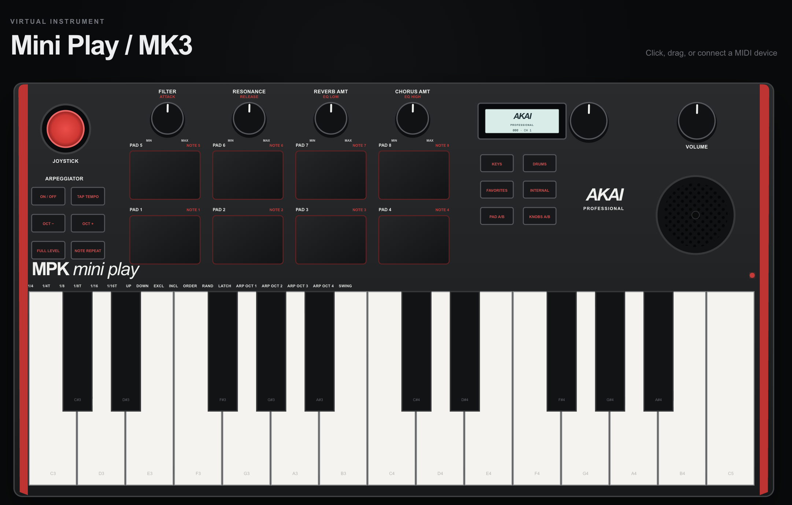

# MPK Hardware Bridge

A hardware-inspired web interface for integrating an Akai MPK Mini Play with browser-based music applications. It provides a responsive virtual control surface, real-time Web MIDI input, interactive controls, and editable MIDI mappings.

> This is an independent development project and is not affiliated with or endorsed by Akai Professional.



## Live demo

[Open MPK Hardware Bridge](https://midilab-virtual-controller.gloza.chatgpt.site)

## Features

- Hardware-inspired top-down controller layout
- 25 interactive mini piano keys
- Eight velocity-style drum pads
- Four parameter knobs, selector dial, and volume dial
- Two-axis joystick with natural pointer movement and automatic centering
- Display, arpeggiator, octave, program, and bank controls
- Individual ID, MIDI assignment, value, and active state for every control
- Centralized reducer-based application state
- Web MIDI input discovery and device selection
- Real-time Note On, Note Off, and Control Change handling
- Automatic UI highlighting when physical MIDI messages are received
- Selected-control inspector with note/CC, channel, label, and value
- JSON mapping import, export, validation, and reset
- Pointer, keyboard, and touch-friendly interactions
- Responsive dark desktop interface

## Tech stack

- React
- TypeScript
- Vite / vinext
- SVG
- Web MIDI API
- CSS

## Requirements

- Node.js 22.13 or newer
- npm
- A Web MIDI-compatible browser, such as Chrome or Edge, for hardware input
- An Akai MPK Mini Play or another MIDI controller for physical integration

## Getting started

Clone the repository and install the dependencies:

```bash
git clone https://github.com/glozahn/mpk-hardware-bridge.git
cd mpk-hardware-bridge
npm install
npm run dev
```

Open the local URL printed in the terminal, normally:

```text
http://localhost:3000
```

Select **Enable Web MIDI**, grant browser permission, and choose the connected MIDI input from the inspector.

## Production build

```bash
npm run build
```

## Default MIDI mapping

| Control | Assignment | Channel |
| --- | --- | --- |
| Piano keys | Notes 48–72 | 1 |
| Drum pads | Notes 36–43 | 10 |
| Parameter knobs and dials | CC 20–25 | 1 |
| Joystick | CC 1 | 1 |
| Octave, program, and bank buttons | CC 110–115 | 1 |

Mappings can be exported as JSON, edited externally, and loaded back into the application.

## Project structure

```text
app/
├── components/
│   ├── ControllerApp.tsx       # Main application layout
│   ├── ControllerSvg.tsx       # Interactive hardware surface
│   └── InspectorPanel.tsx      # MIDI, mapping, and control details
├── lib/
│   └── controller-data.ts      # Control types and default mappings
├── store/
│   └── controller-store.tsx    # Central state, Web MIDI, and JSON I/O
├── globals.css                 # Visual system and responsive layout
├── layout.tsx                  # Metadata and document shell
└── page.tsx                    # Application route
```

## Web MIDI notes

Web MIDI requires explicit browser permission. Outside `localhost`, the application must be served through HTTPS. Browser support varies, so Chromium-based browsers are recommended for physical-device testing.

## Roadmap

- Bidirectional synchronization with physical hardware
- User-editable control assignments in the inspector
- Preset and program management
- MIDI output support
- DAW and synthesizer integration profiles

## License

Add a license before distributing or accepting external contributions.
